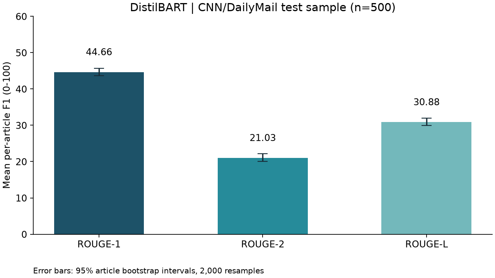
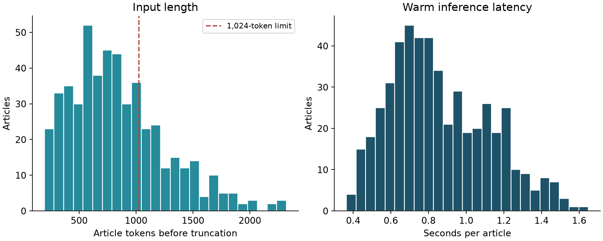

# Evaluation report

Evaluation completed: 2026-10-09T06:41:03.777152+00:00.

## Dataset and protocol

CNN/DailyMail 3.0.0 official test split, 500 articles sampled without replacement
from 11,490 rows using NumPy default_rng(seed=42). Row indices, article IDs,
upstream revision, and file hashes are in `data/evaluation_manifest.json`.
No training, fine-tuning, or test-driven model selection was performed.
The checkpoint was selected for task fit and local inference before evaluation.

## Measured quality

| Metric | Mean F1 (0-100) | 95% bootstrap interval |
|---|---:|---:|
| ROUGE-1 | 44.66 | 43.66–45.67 |
| ROUGE-2 | 21.03 | 20.01–22.13 |
| ROUGE-L | 30.88 | 29.91–31.97 |

These are macro-averages of per-article F1, multiplied by 100. ROUGE uses
`rouge-score` with Porter stemming. ROUGE-L is the longest common subsequence
metric, not ROUGE-Lsum. Reference highlights are supplied unchanged. The
95% percentile intervals use 2,000 article-level bootstrap resamples (seed 42).
Intervals describe sampling variability within this dataset, not factual accuracy.
They do not cover changes in model, decoding, domain, or publisher mix.

## Inference and truncation

- Model: `sshleifer/distilbart-cnn-12-6` at revision `a4f8f3ea906ed274767e9906dbaede7531d660ff`.
- Input limit: 1,024 tokens including special tokens; excess tail tokens are discarded.
- Output: 30–128 new tokens, 4 beams, length penalty 2, no repeated trigrams,
  early stopping enabled, sampling disabled.
- Execution: `cuda`, `torch.float16`, eager attention.
- GPU: NVIDIA GeForce RTX 4060 Laptop GPU; peak allocated GPU memory: 717.55 MB.
- Mean latency: 0.859 s; median: 0.810 s;
  p95: 1.337 s.
- Total measured inference time: 7.16 minutes.
- Truncated articles: **142/500 (28.4%)**.
- Mean input length: 847.53 tokens;
  maximum: 2321 tokens.

Latency includes preprocessing, tokenization, generation, and decoding, after
model loading and one synthetic warm-up. It excludes startup, network, and API
queue time. Requests are processed one at a time to bound GPU memory use.
It is a local measurement, not a production throughput benchmark.

## Interpretation and limitations

ROUGE-1 measures unigram overlap; ROUGE-2 measures bigram overlap; ROUGE-L
captures overlap in ordered sequences. Valid paraphrases may score lower than
literal copying. ROUGE cannot establish factual consistency, so sample outputs
also need qualitative review. Truncation can remove important later details.
The report compares generated summaries against full reference highlights even
when the model sees only the article prefix; it does not shorten references.

The checkpoint was trained on the CNN/DailyMail task, so this is an in-domain
held-out benchmark, not evidence of broad generalization to current news.
The dataset represents older English news from two publishers (2007–2015) and
does not represent all regions, languages, or current reporting styles.
Only one model was tested; no unsupported model-comparison claims are made.

## Reproduction and audit trail

`predictions.jsonl` stores all 500 IDs, source row indices, reference summaries,
generated summaries, lengths, latencies, truncation flags, and individual scores.
`metrics.json` records configuration, hardware, software, revisions, and code
hashes. `sample_summaries.json` includes the first five randomly sampled input
articles, selected by sample order, not score. `environment.txt` captures installed
packages. Exact outputs or timings may differ across hardware and software.

Run `python -m news_summarization.prepare` then
`python -m news_summarization.evaluate --resume` and
`python -m news_summarization.report` from the activated project environment.
The evaluator verifies the data checksum and refuses to mix different runs.
For a fresh evaluation, archive the ignored progress JSONL before rerunning.

## Sources

- [Dataset card](https://huggingface.co/datasets/abisee/cnn_dailymail)
- [Model card](https://huggingface.co/sshleifer/distilbart-cnn-12-6)
- [ROUGE implementation](https://github.com/google-research/google-research/tree/master/rouge)
